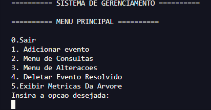
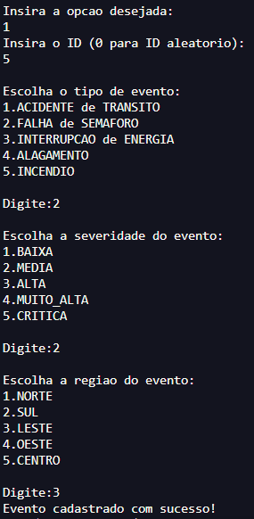
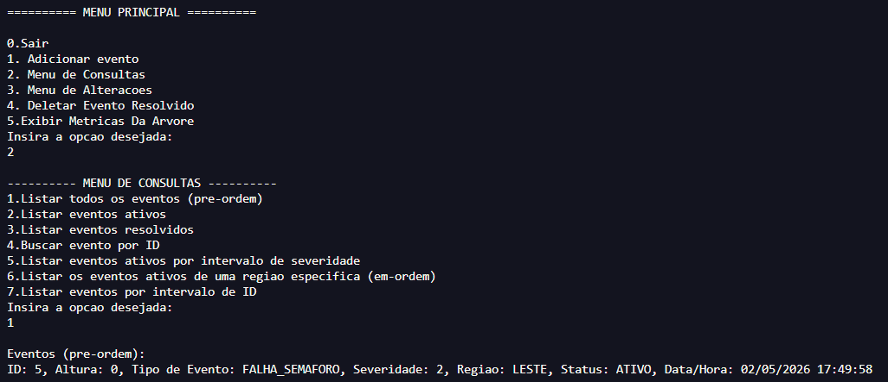
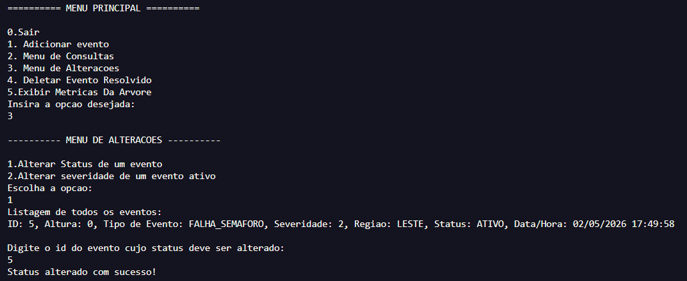
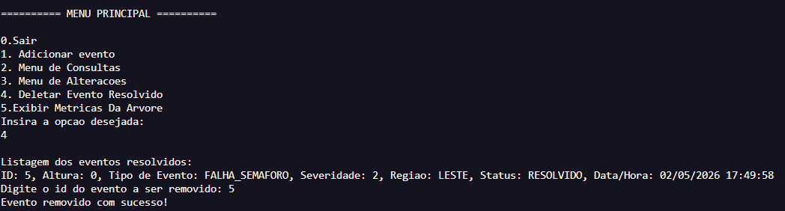
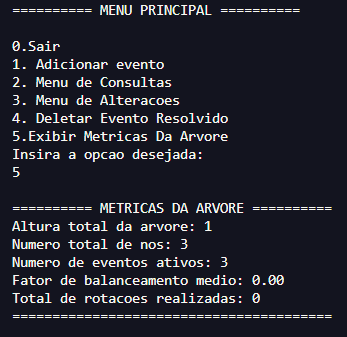
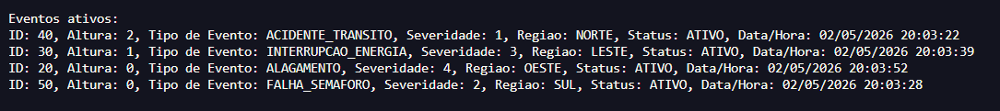
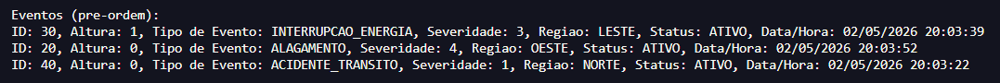
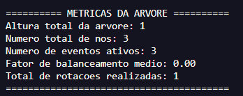
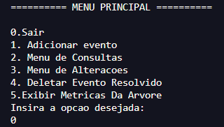

# Sistema de Gerenciamento de Eventos Críticos de uma Cidade Inteligente

## Descrição Geral

Este programa implementa um **sistema de gerenciamento de eventos urbanos** baseado em uma **Árvore AVL** (árvore binária de busca auto-balanceada). Cada nó da árvore representa um evento urbano registrado na cidade, e a estrutura garante buscas e inserções eficientes mesmo com grande volume de dados.

### Tipos de eventos suportados

- Acidente de Trânsito
- Falha de Semáforo
- Interrupção de Energia
- Alagamento
- Incêndio

### Cada evento armazena

- **ID único** (gerado automaticamente ou informado pelo usuário)
- **Tipo** do evento
- **Severidade** (Baixa / Média / Alta / Muito Alta / Crítica)
- **Região da cidade** (Norte / Sul / Leste / Oeste / Centro)
- **Status** (Ativo / Resolvido)
- **Data e hora** do cadastro (capturada automaticamente do sistema)

### Funcionalidades

**Cadastro**
- Inserção de eventos com ID manual ou gerado aleatoriamente
- Garantia de IDs únicos com rejeição automática de duplicatas
- Inserção com rebalanceamento automático da árvore

**Consultas**
- Listagem de todos os eventos (pré-ordem)
- Filtro por eventos ativos ou resolvidos
- Busca por ID
- Filtro por intervalo de severidade
- Filtro por região (percurso em-ordem)
- Filtro por intervalo de ID

**Alterações**
- Alternar status de um evento entre Ativo e Resolvido
- Alterar a severidade de um evento ativo

**Remoção**
- Exclusão de eventos com status Resolvido (com rebalanceamento automático da árvore)

**Métricas da Árvore**
- Altura total
- Número de nós
- Quantidade de eventos ativos
- Fator de balanceamento médio
- Total de rotações realizadas (LL, RR, LR, RL)

---

## Executando o programa

Se você apenas quiser rodar o programa sem compilar, basta executar o arquivo já compilado:

```
programa.exe
```

> **Requisito:** Windows (o `.exe` foi gerado para este sistema operacional).

---

## Instruções de Compilação

Caso queira compilar o código-fonte manualmente, você precisará de um compilador C. As instruções variam conforme o ambiente.

### Pré-requisitos

Os seguintes arquivos devem estar no mesmo diretório:

```
evento.h
evento.c
main.c
```

---

### Windows (com GCC via MinGW ou MSYS2)

Se você tiver o [MinGW](https://www.mingw-w64.org/) ou [MSYS2](https://www.msys2.org/) instalado:

```bash
gcc evento.c main.c -o programa
```

Ou, se quiser gerar um `.exe` explicitamente:

```bash
gcc evento.c main.c -o programa.exe
```

Para executar:

```bash
programa.exe
```

---

### Linux / macOS

Com o GCC instalado (geralmente já disponível), abra o terminal na pasta do projeto e execute:

```bash
gcc evento.c main.c -o programa
```

Para executar:

```bash
./programa
```

---

### Flags opcionais recomendadas

Para compilar com avisos e padrão C99:

```bash
gcc evento.c main.c -o programa -Wall -std=c99
```

---

## Estrutura dos Arquivos

| Arquivo      | Descrição                                                        |
|--------------|------------------------------------------------------------------|
| `evento.h`   | Declarações das structs, enums e interfaces das funções          |
| `evento.c`   | Implementação da árvore AVL e todas as operações sobre eventos   |
| `main.c`     | Interface com o usuário — menus e leitura de entradas            |
| `programa.exe` | Executável pré-compilado para Windows                          |

# Testes:

1. Adicionamos um evento na árvore digitando "1" no menu principal:
<div align="center">
  
</div>

Deve-se informar o id, o tipo de evento, a severidade e a região do evento. Data e hora são atribuídos automaticamente:
<div align="center">
  
</div>

2. Podemos visualizar o que digitamos. Inserimos "2" para entrar no menu de consultas e depois "1" para listar todos os eventos da árvore:
<div align="center">
  
</div>

3. Se quisermos alterar o status de "ATIVO" para "RESOLVIDO", digitamos "3" no menu principal para entrar no menu de alterações e depois "1", que é a opção de alterar status de eventos. Como nosso evento estava ATIVO, essa opção altera para RESOLVIDO:
<div align="center">
  
</div>

4. Agora que esse evento está com status "RESOLVIDO", podemos remover da árvore. Basta escolher a opção "Deletar Evento Resolvido" digitando "4" no menu principal. Essa opção lista todos os eventos ativos. Agora digitamos o id de nosso alvo:
<div align="center">
  
</div>

5. Podemos adicionar mais eventos conforme fizemos anteriormente e digitar "5" no menu principal para ver as métricas da árvore:
<div align="center">
  
</div>

6. Numa nova árvore, adicionamos os eventos com IDs [40, 50, 30, 20] nessa ordem e mostramos em pre-ordem:
<div align="center">
  
</div>

7. Agora removemos o evento com ID 50 após torná-lo RESOLVIDO para ver o rebalanceamento:
<div align="center">
  
</div>

8. Também é possível conferir nas métricas da árvore:
<div align="center">
  
</div>

9. No menu principal, digitamos "0" para fechar o sistema:
<div align="center">
  
</div>


